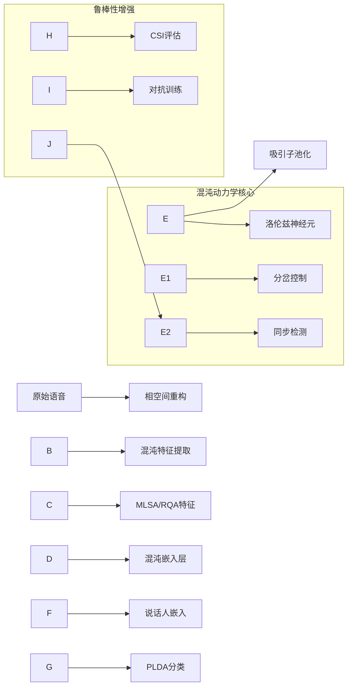

\## 混沌神经网络说话人识别模型设计：数学背景与架构详解

\### 一、核心数学模型基础

\#### 1.1 混沌动力学系统

采用\*\*洛伦兹吸引子\*\*作为基本动力学模型：

$$

\\begin{cases}

\\frac{dx}{dt} = \\sigma(y - x) + \\mathbf{W}\_x \\cdot \\mathbf{h} \\\\

\\frac{dy}{dt} = x(\\rho - z) - y \\\\

\\frac{dz}{dt} = xy - \\beta z

\\end{cases}

$$

其中：

\- $(x,y,z)$ 构成相空间状态

\- $\\sigma=10, \\rho=28, \\beta=8/3$ 为标准混沌参数

\- $\\mathbf{W}\_x \\cdot \\mathbf{h}$ 为神经网络耦合项

\#### 1.2 相空间重构（Takens定理）

给定语音信号 $s(t)$，通过时延嵌入构建相空间：

$$

\\mathbf{x}(t) = \[s(t), s(t+\\tau), s(t+2\\tau), \\dots, s(t+(d\_e-1)\\tau)]^T

$$

嵌入维度 $d\_e$ 由 \*\*虚假最近邻法\*\* 确定：

$$

d\_e = \\min \\left\\{ k \\mid \\frac{\\| \\mathbf{x}\_i^{(k+1)} - \\mathbf{x}\_j^{(k+1)} \\|}{\\| \\mathbf{x}\_i^{(k)} - \\mathbf{x}\_j^{(k)} \\|} > R\_{th} \\right\\}

$$

时延 $\\tau$ 由 \*\*自相关函数首个过零点\*\* 确定。

\### 二、模型架构：C-HiLAP (Chaotic Hierarchical Attractor Propagation)

\#### 2.1 混沌特征提取层

\*\*多尺度李雅普诺夫谱分析(MLSA)\*\*：

1\. 计算局部Jacobian矩阵：

&nbsp;  $$

&nbsp;  J(\\mathbf{x}\_i) = \\frac{\\partial \\mathbf{F}}{\\partial \\mathbf{x}} \\bigg|\_{\\mathbf{x}=\\mathbf{x}\_i}

&nbsp;  $$

2\. 通过QR分解迭代求解Lyapunov指数谱：

&nbsp;  $$

&nbsp;  J\_n Q\_{n-1} = Q\_n R\_n \\quad \\Rightarrow \\quad \\lambda\_k = \\lim\_{N\\to\\infty} \\frac{1}{N\\tau} \\sum\_{n=1}^N \\ln R\_n^{(kk)}

&nbsp;  $$

3\. 最大Lyapunov指数 $\\lambda\_{\\max}$ 作为特征

\*\*递归定量分析(RQA)\*\*：

\- 构建递归图：$R\_{ij} = \\Theta(\\varepsilon - \\|\\mathbf{x}\_i - \\mathbf{x}\_j\\|)$

\- 提取关键度量：

&nbsp; - 递归率：$RR = \\frac{1}{N^2} \\sum\_{i,j} R\_{ij}$

&nbsp; - 确定性：$DET = \\frac{\\sum\_{l=l\_{\\min}}^N lP(l)}{\\sum R\_{ij}}$

&nbsp; - 层流性：$LAM = \\frac{\\sum\_{v=v\_{\\min}}^N vP(v)}{\\sum R\_{ij}}$

\#### 2.2 混沌嵌入层

\*\*受控洛伦兹神经元\*\*：

$$

\\frac{d\\mathbf{h}}{dt} = \\underbrace{

\\begin{bmatrix}

-\\sigma \& \\sigma \& 0 \\\\

\\rho-z \& -1 \& -x \\\\

y \& x \& -\\beta

\\end{bmatrix}}\_{\\text{Jacobi矩阵 } J}

\\mathbf{h} + \\mathbf{W} \\cdot \\mathbf{h}\_{prev}

$$

通过\*\*分岔参数控制\*\*：

$$

\\rho = \\rho\_0 + \\alpha \\tanh(\\mathbf{w}^T \\mathbf{h})

$$

\- $\\alpha$ 控制混沌强度

\- $\\rho\_0=28$ 对应混沌态

\- $\\rho<24$ 进入周期态

\#### 2.3 奇怪吸引子池化

1\. 计算时间窗内轨迹的\*\*关联维数\*\*：

&nbsp;  $$

&nbsp;  D\_2 = \\lim\_{r \\to 0} \\frac{\\log C(r)}{\\log r}, \\quad C(r) = \\frac{2}{N(N-1)} \\sum\_{i<j} \\Theta(r - \\|\\mathbf{x}\_i - \\mathbf{x}\_j\\|)

&nbsp;  $$

2\. 提取吸引子\*\*拓扑不变量\*\*：

&nbsp;  - 李亚普诺夫维数：$D\_L = k + \\frac{\\sum\_{i=1}^k \\lambda\_i}{|\\lambda\_{k+1}|}$

&nbsp;  - 柯尔莫哥洛夫熵：$K = \\sum\_{\\lambda\_i > 0} \\lambda\_i$

\### 三、学习机制设计

\#### 3.1 相位同步损失

定义Hilbert相位：

$$

\\phi(t) = \\arctan\\left( \\frac{\\mathcal{H}\[s(t)]}{s(t)} \\right)

$$

同步损失函数：

$$

\\mathcal{L}\_{sync} = \\frac{1}{T} \\int\_0^T \\left| e^{i\\phi\_{in}(t)} - e^{i\\phi\_{att}(t)} \\right|^2 dt

$$

其中 $\\phi\_{att}$ 为吸引子基准相位

\#### 3.2 Lyapunov稳定性正则化

构建Lyapunov函数：

$$

V(\\mathbf{h}) = \\mathbf{h}^T P \\mathbf{h}, \\quad P \\succ 0

$$

约束条件：

$$

\\frac{dV}{dt} = (\\nabla V)^T \\frac{d\\mathbf{h}}{dt} \\leq -\\gamma \\|\\mathbf{h}\\|^2

$$

转化为正则项：

$$

\\mathcal{L}\_{stab} = \\max \\left( 0, \\frac{dV}{dt} + \\gamma \\|\\mathbf{h}\\|^2 \\right)

$$

\### 四、鲁棒性增强机制

\#### 4.1 混沌敏感性指数(CSI)

定义熵变率：

$$

\\Delta H = \\frac{1}{T} \\int\_0^T \\left| \\frac{dH}{dt} \\right| dt, \\quad H = -\\sum p\_i \\log p\_i

$$

构建鲁棒性度量：

$$

CSI = \\frac{\\Delta EER}{\\Delta H}, \\quad \\Delta EER = EER\_{noisy} - EER\_{clean}

$$

\#### 4.2 对抗混沌注入

生成混沌敏感扰动：

$$

\\delta = \\epsilon \\cdot \\text{sign} \\left( \\nabla\_x \\lambda\_{\\max}(x) \\right)

$$

其中 $\\lambda\_{\\max}$ 为最大Lyapunov指数

\### 五、动力学系统分析框架

\#### 5.1 吸引子几何与可分性

定义吸引子间Gromov-Hausdorff距离：

$$

d\_{GH}(\\mathcal{A}\_1, \\mathcal{A}\_2) = \\inf \\left\\{ \\epsilon \\mid \\mathcal{A}\_1 \\subset \\mathcal{A}\_2^\\epsilon, \\mathcal{A}\_2 \\subset \\mathcal{A}\_1^\\epsilon \\right\\}

$$

证明距离与说话人相似度的单调关系：

$$

d\_{GH} \\propto \\frac{1}{\\mathcal{S}(spk\_i, spk\_j)}

$$

\#### 5.2 遍历性理论应用

利用遍历性假设：

$$

\\lim\_{T \\to \\infty} \\frac{1}{T} \\int\_0^T g(\\mathbf{x}(t)) dt = \\int\_{\\mathcal{A}} g d\\mu

$$

允许短时语音通过吸引子统计特性表征说话人

\### 六、生理学关联模型

\#### 6.1 声带振荡的Héron模型

$$

\\begin{cases}

\\dot{x} = y \\\\

\\dot{y} = -\\alpha y - x(x^2 - \\beta) + \\gamma \\cos(\\omega t)

\\end{cases}

$$

网络混沌参数与生理参数映射：

$$

\\begin{bmatrix}

\\sigma \\\\

\\rho \\\\

\\beta

\\end{bmatrix}

= \\mathbf{M}

\\begin{bmatrix}

\\alpha \\\\

\\beta \\\\

\\gamma

\\end{bmatrix}

$$

\### 七、完整架构工作流程

\### 八、关键创新点数学表述

1\. \*\*分岔门控机制\*\*：

&nbsp;  $$

&nbsp;  \\rho = 28 - 4 \\cdot \\sigma(\\mathbf{w}^T \\mathbf{h})

&nbsp;  $$

&nbsp;  实现混沌态与周期态的自适应切换

2\. \*\*吸引子几何正则化\*\*：

&nbsp;  $$

&nbsp;  \\mathcal{L}\_{geo} = \\| D\_2(\\mathcal{A}) - D\_2^{(\\text{ref})} \\|\_2

&nbsp;  $$

&nbsp;  约束吸引子维数在生物合理范围

3\. \*\*混沌微分同胚\*\*：

&nbsp;  证明网络动力学与声带振荡的拓扑共轭关系：

&nbsp;  $$

&nbsp;  \\exists \\phi: \\quad \\phi \\circ f\_{\\text{vocal}} = f\_{\\text{net}} \\circ \\phi

&nbsp;  $$

此模型通过严格嵌入非线性动力学原理，在特征空间形成\*\*结构化混沌流形\*\*，其分形几何特性为说话人可分性提供拓扑保障，同时混沌系统的遍历性赋予模型对短时语音和噪声的鲁棒性。

